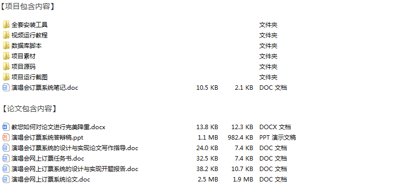
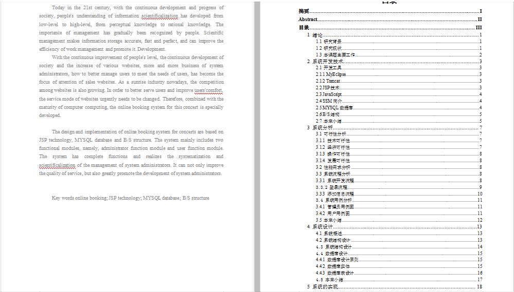
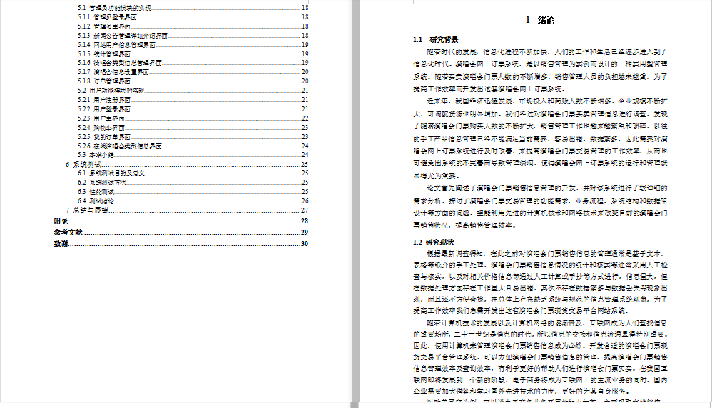
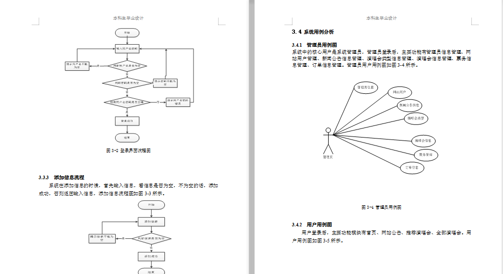
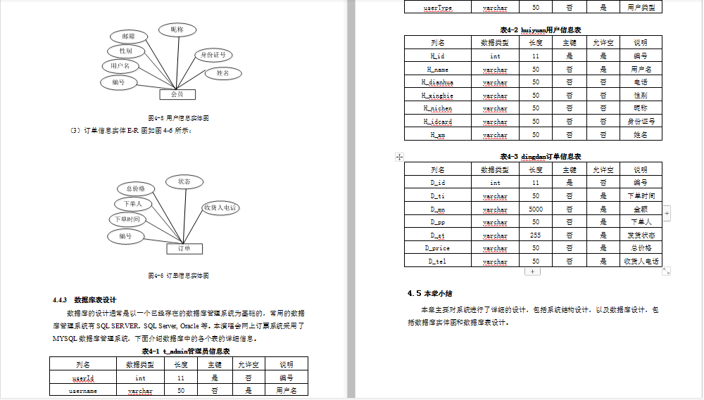
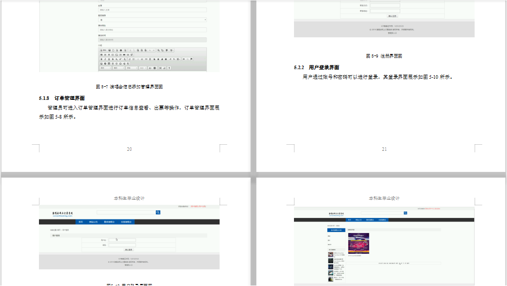
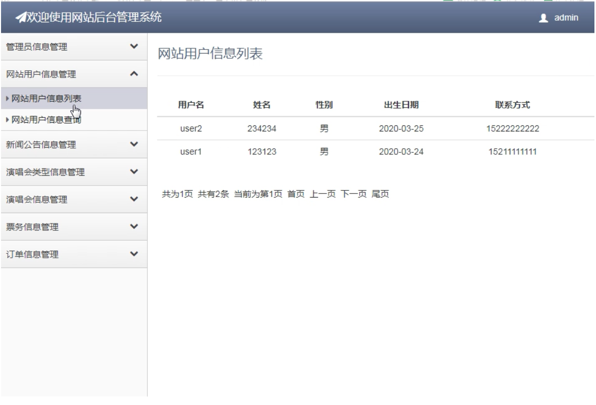
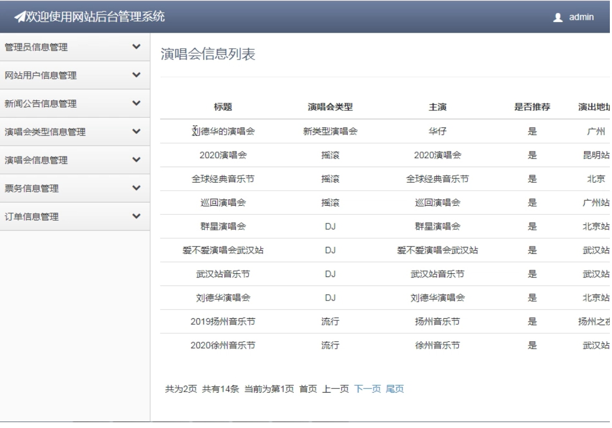

# 演唱会网上订票系统SSM+MySQL

#### 介绍
SSM+Bootstrap+MYSQL演唱会网上订票系统

项目功能演示视频： https://www.bilibili.com/video/BV1i34y1y7yP/

SSM+Bootstrap演唱会网上订票系统设计与实现(SSM,MySQL)(毕业论文11000字以上,程序代码,MySQL数据库)

【项目功能描述】  

    系统中的核心用户是系统管理员，管理员登录后，主要功能有管理员信息管理、网站用户管理、新闻公告信息管理、演唱会类型信息管理、演唱会信息管理、票务信息管理、订单信息管理。

用户功能模块的实现

用户注册

用户通过账号、密码、真实姓名、联系电话等信息可以进行登注册

用户登录

用户通过账号和密码可以进行登录

用户登录后可进行首页、网站公告、推荐演唱会、全部演唱会等，用户主界面展示如图5-11所示。

用户可以进行演唱会信息浏览等操作

购物车界面

用户可将演唱会门票加入购物车，移除、下订单等操作，购物车界面。

我的订单界面

用户可进行付款等操作，订单管理界面

  【开发环境】

        Eclipse + JDK1.8 + Tomcat8 + Mysql

                                                                           

【部分论文截图】      

a

【部分项目截图】

